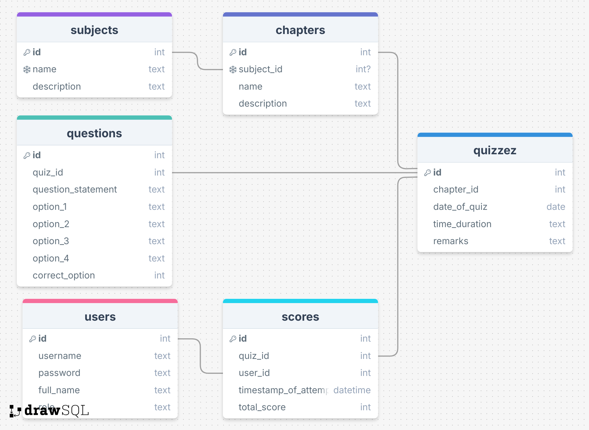

# Quiz Master - V1

## Overview
Quiz Master is a multi-user web application designed for exam preparation across multiple courses. The platform supports two roles: **Admin** (Quiz Master) and **Users**, allowing quiz management, subject-wise question categorization, and performance tracking.

## Tech Stack
- **Backend:** Flask
- **Templating Engine:** Jinja2
- **Frontend:** HTML, CSS, Bootstrap
- **Database:** SQLite

## Features
### Admin (Quiz Master)
- **Superuser Access:** Prexsisting in database
- **Dashboard Management:**
  - [x] Create, edit, and delete subjects.
  - [x] Create, edit, and delete chapters under subjects.
  - [x] Create quizzes under chapters.
  - [x] Add multiple-choice questions (MCQs) with one correct option.
  - [x] Define quiz date and duration.
  - [x] View and manage registered users.
  - [x] View quiz performance and generate summary charts.
- **Search Functionalities:**
  - [x] Search users, subjects, and quizzes.

### User
- **Registration & Authentication:**
  - [x] Users must sign up with an email and password.
  - [x] Additional fields include full name, qualification, and date of birth.
- **Quiz Management:**
  - [x] Select subject and chapter for quiz attempts.
  - [x] Timed quizzes (optional timer feature).
  - [x] View previous quiz attempts and scores.
  - [x] Summary charts for performance tracking.

## Database Schema

<details>
<summary>Database Schema Image</summary>
  
  
  
</details>

## Core Functionalities
### Admin Panel
- CRUD operations for subjects, chapters, quizzes, and questions.
- View and manage user profiles.
- Track user quiz attempts and performance.
- Generate reports and summary charts.

### User Dashboard
- Browse available quizzes by subject and chapter.
- Take quizzes and receive instant scores.
- Track past quiz performances.
- View graphical summaries of performance trends.

## Additional Functionalities
### Recommended Enhancements
- RESTful APIs using Flask (`flask_restful` or JSON responses).
- Frontend form validation (HTML5/JavaScript).
- Backend validation (Flask controllers).
- Chart integration (e.g., Chart.js).

### Optional Features
- Enhanced UI/UX with Bootstrap.
- Secure authentication (`flask_login`, `flask_security`).
- Additional quiz modes or question types.

## How To Run

### Prerequisites
- Python 3.7 or higher
- uv (Python package manager)

### Installation Steps
1. **Clone the repository:**
  ```
  git clone https://github.com/SpreadSheets600/QuizMaster-V1.git
  cd QuizMaster-V1/quiz_master_24F2008474
  ```

2. **Install dependencies using uv:**
  ```
  pip install uv
  uv sync
  ```

3. **Run the application:**
  ```
  uv run app.py
  ```

6. **Access the application:**
  Open your web browser and navigate to `http://localhost:5000`

### Default Admin Credentials
- **Username:** admin
- **Password:** admin

### Notes
- The application uses SQLite by default, no additional database setup required

